<h1 align="center" style="border-bottom: none;">🚀 <동국대학교 아싸리 팀> 인공지능을 이용한 챗봇구축</h1>
<h3 align="center">Watson Assistant를 이용하여, 착한 가격 업소를 추천하는 챗봇을 구축하였다.</h3>

 

- <a href="https://www.youtube.com/watch?v=n5nJERzv2Ow&t=148s">🖥 시연 영상 바로가기</a>

## Project description

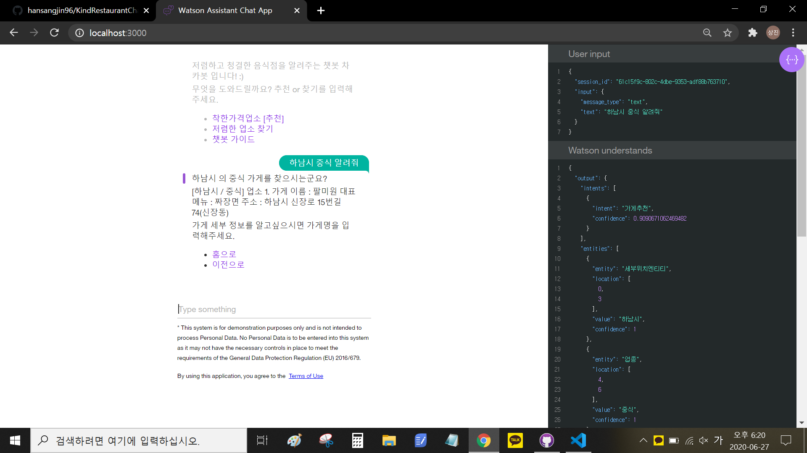

- <h3 align="left">로컬호스트 3000으로 실행했을때, 하남시의 중식을 알려주는 데모 스크린샷.</h3>
- <h3 align="left">"하남시 중식 알려줘"라는 해당 text 의 intent 는 "가게 추천"이 0.909%확률로 들어가고, 세부위치entity에 하남시가, 업종에 중식이 들어가서 그에 맞는 답변을 출력하는 형식으로 진행된다.</h3>
- <h3 align="left">코드 작성 부분</h3>

- <h5 align="left">1) watson_webhook_code - webhook코드 작성(csv파일에서 조건에 맞게 가게의 정보를 가져오는 코드)</h3>
- <h5 align="left">2) watson-voice-bot-20200627061848209-master - stt,tts기능을 구현한 코드 </h3>
- <h5 align="left">3) 1),2)를 제외한 대부분의 코드 ex)app.js</h3>

---

 

 

 

## Watson Assistant 구성

<h3 align="left">1. 다음 사진과 같이 Intent, Entity, Dialog를 구성하여 챗봇을 학습시켰다.</h3>

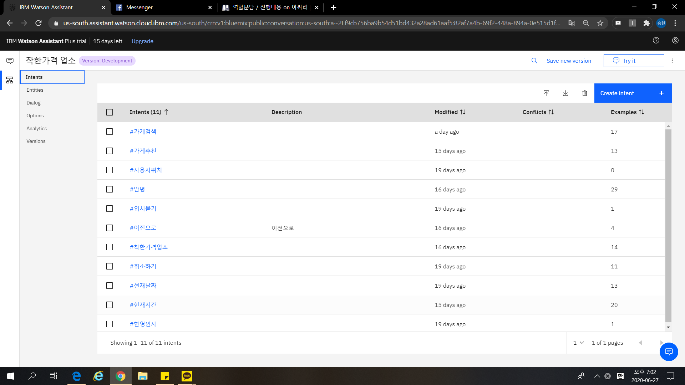

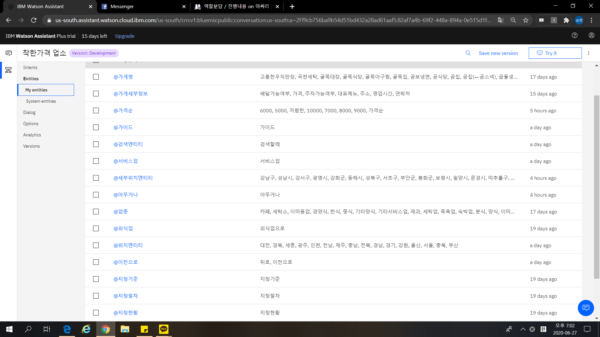

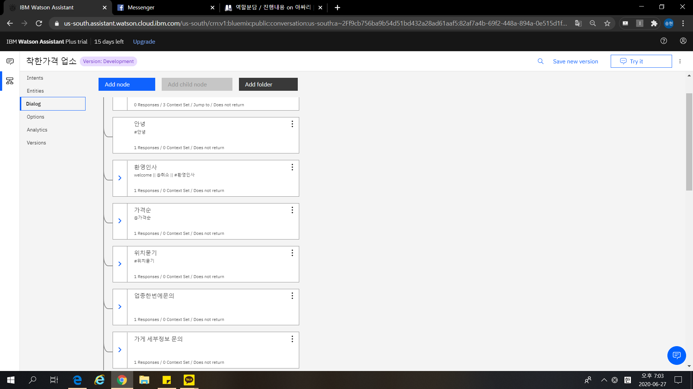

 

<h3 align="left">2. Webhook을 설정하여 CSV파일에서 가게의 정보를 찾아오도록 설계하였다.</h3>

- <h5 align="left">코드 작성 부분 : watson_webhook_code </h3>

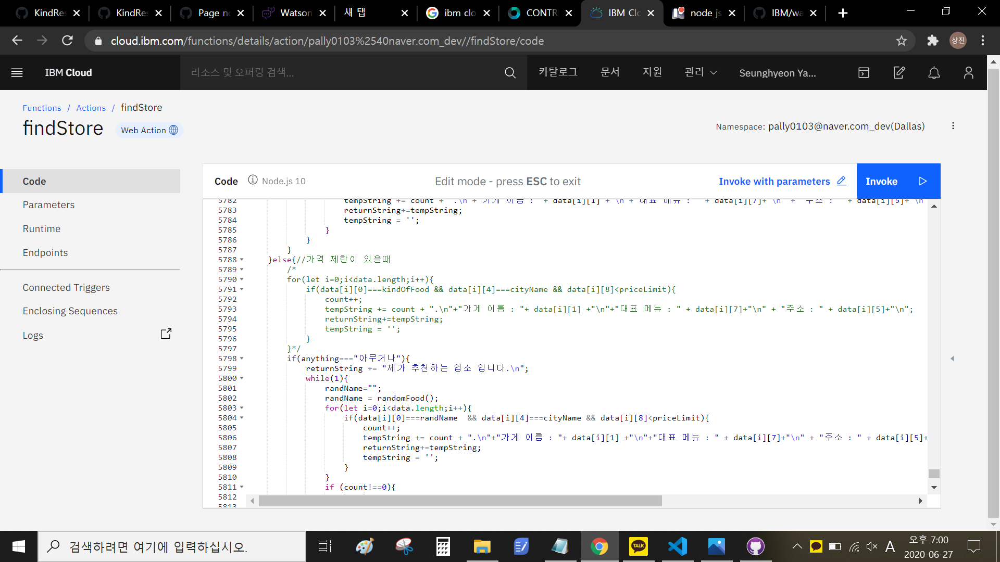
 

<h3 align="left">3. Facebook Messenger과 연동하여 접근성을 향상시켰다.</h3>

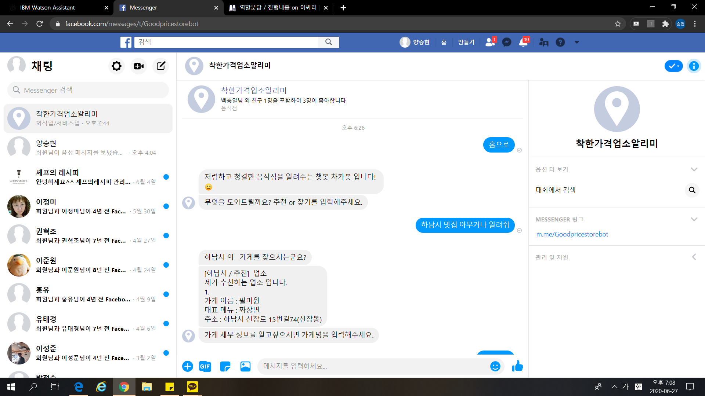

---

 
 

 

## 음성인식 구현과 한계

<h3 align="left">1. Watson의 Developer Tool을 이용해 Watson local Github에서 Speech to Text, Text to Speech 작업 코드 작성</h3>

- <h5 align="left">코드 작성 부분 : watson-voice-bot-20200627061848209-master </h3>

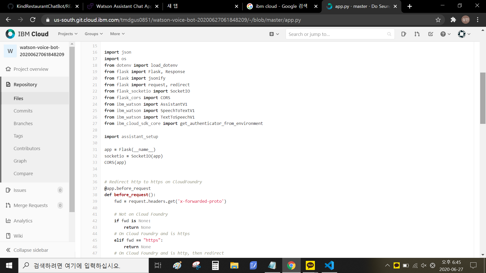
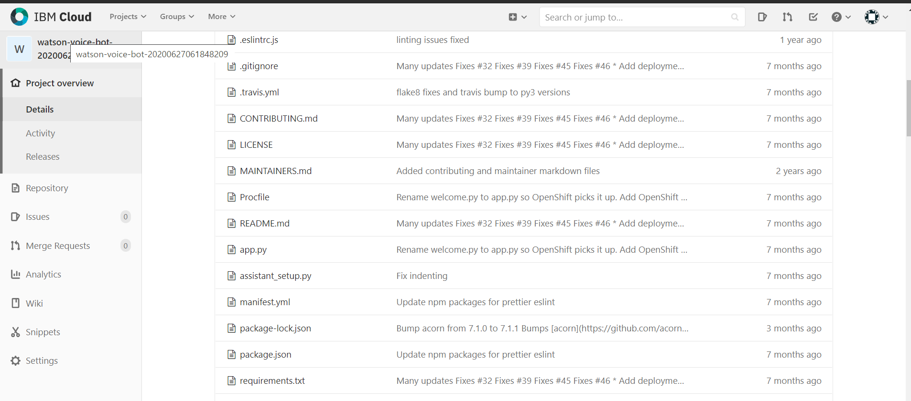
 

<h3 align="left">2. Watson Developer 과 Assistant를 연결하여 Local app에서 동작 실행</h3>

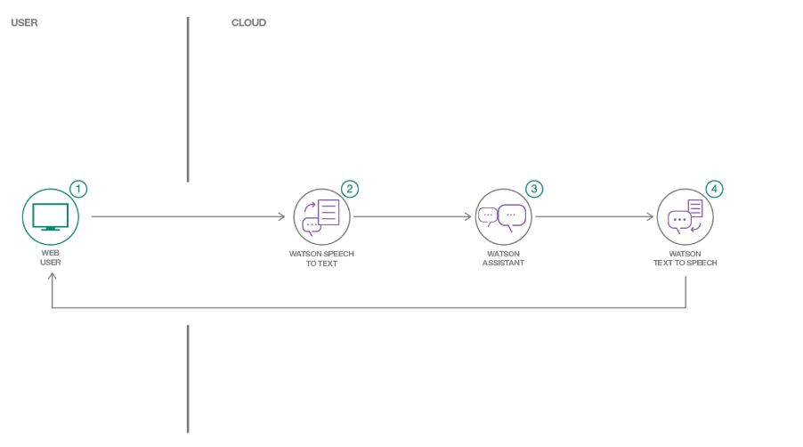
 

<h3 align="left">3. 한글 인식률의 부재, json 파일 구조 문제로 인한 음성인식 기술 구현의 어려움 (영어로는 동작하지만, 한글로 동작하지 않음)</h3>

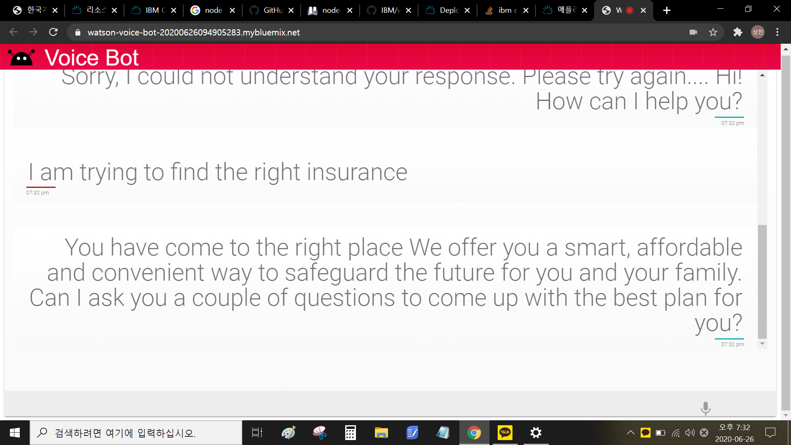
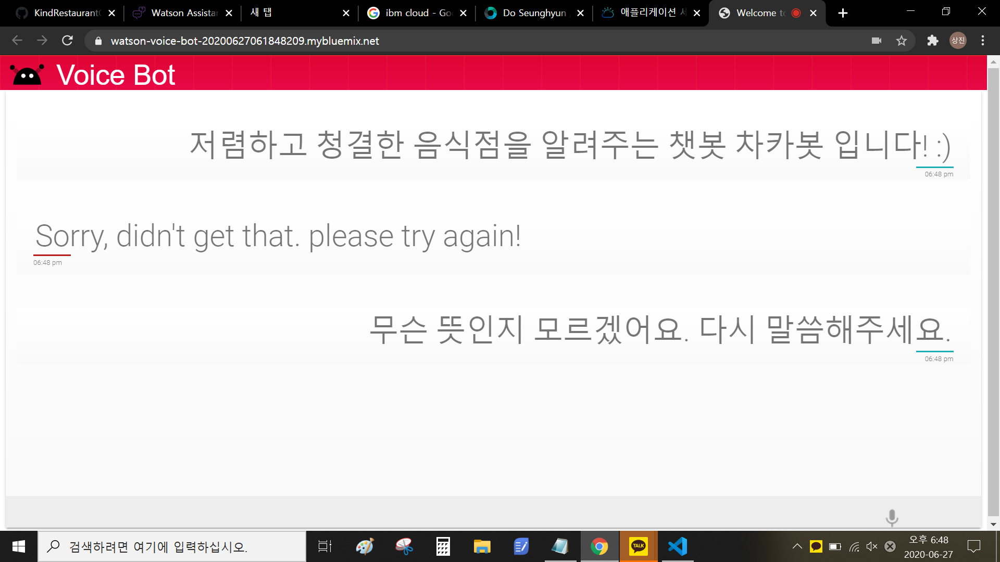

 

<h3 align="left">4. 따라서 휴대폰의 음성인식 기술을 활용하여 페이스북 메신저를 통해 구현하였다.</h3>

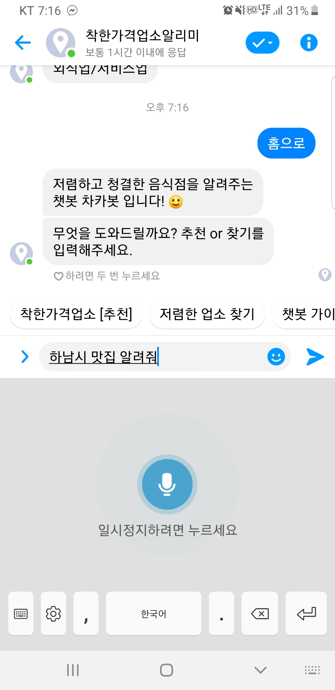
